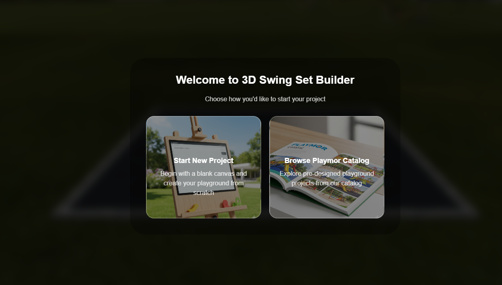

# 3D Swing Set Builder

<div align="center">
  

<!-- Add your website screenshot as 'screenshot.png' in the root directory -->

**An interactive 3D playground builder for designing custom swing sets and playgrounds**

[](https://playmorswingsets.com/builder)

[View Live Demo](https://playmorswingsets.com/builder) | [Report Bug](#) | [Request Feature](#)

</div>

---

## 📋 Overview

The **3D Swing Set Builder** is an interactive web-based application that allows users to design and visualize custom playground equipment and swing sets in 3D. Built for Playmor Swing Sets, this tool provides an intuitive interface for creating personalized outdoor play areas with real-time 3D rendering.

## ✨ Features

### 🎨 Design Tools
- **Interactive 3D Canvas** - Drag, drop, and position playground components in real-time
- **Visual Product Catalog** - Browse hundreds of playground components including:
  - Swing beams (3, 4, and disc swing configurations)
  - Towers (DX Play Tower, Sky Tower, King's Tower, Summit Tower, Sky Tower)
  - Slides (Wave Slide, Side Winder, Super Spiral, Turbo Twister)
  - Swings (Baby Swing, Ball Swing, Bird's Nest, Disc Swing, Tire Swing, Horse Glider, Trapeze)
  - Climbing features (Rock Climb, Cargo Net, Monkey Bars, Climbing Pole)
  - Accessories (Bridge, Gang Plank, Kitchen Kit, Picnic Table, and more)

### 🛠️ Customization Options
- **Color Customization** - Choose frame, trim, and roof colors
- **Material Selection** - Select between different material options (Poly and more)
- **Mulch Configuration** - Visualize mulch area with curb options
- **Size Adjustments** - Dynamic length and width controls
- **Background Toggle** - Show/hide background for better visualization
- **Dimension Display** - Real-time measurement display

### 📦 Project Management
- **Save Designs** - Download your custom playground design
- **Load Designs** - Upload previously saved configurations
- **Pre-designed Sets** - Browse and start from Playmor catalog designs
- **Quote Generation** - Get pricing quotes directly from your design
- **Parts List** - Detailed component list for your configuration

### 🎮 User Controls
| Control | Action |
|---------|--------|
| **SPACE BAR** | Change connection point while placing items |
| **ESC** | Cancel current item selection |
| **Mouse Drag** | Rotate and pan camera view |
| **Mouse Wheel** | Zoom in/out |

## 🚀 Live Demo

Experience the builder in action: **[https://playmorswingsets.com/builder](https://playmorswingsets.com/builder)**

## 📁 Project Structure

```
Yard/
├── playmor/                 # Web application files
│   └── public_html/
│       └── yard/            # Main application directory
│           ├── *.js         # JavaScript application files
│           ├── *.json       # Configuration files
│           └── *.png        # UI assets and icons
```

## 🎯 Key Components

### 3D Models (GLB Format)
The project includes over 50+ playground components as optimized GLB (GL Transmission Format Binary) files:
- **Swing Beams**: 8ft and 10ft configurations
- **Towers**: Multiple tower designs with varying heights (5ft, 7ft options)
- **Slides**: Various slide types with height options
- **Swings**: Multiple swing types including specialty swings
- **Climbers**: Nets, poles, rock walls, and monkey bars
- **Accessories**: Kits, panels, and decorative elements

### Python Utilities
Helper scripts for model management and verification:
- Model extraction and processing
- Size comparison and validation
- Tire swing joint modifications
- GLB file replacement and updates

## 💻 Technology Stack

- **3D Rendering**: WebGL-based 3D graphics
- **3D Models**: GLB (glTF 2.0 Binary) format
- **Frontend**: JavaScript, HTML5, CSS3
- **Backend**: PHP for quote generation and data handling
- **Model Processing**: Python scripts for GLB manipulation

## 🎨 Design Features

- **Real-time 3D Visualization** - See your playground design from any angle
- **Material Preview** - Visualize different color and material combinations
- **Safety Zone Display** - Mulch area calculation with customizable curbs
- **Responsive Interface** - Works on desktop and tablet devices
- **Catalog Integration** - Pre-designed playground sets from Playmor catalog

## 📞 Contact & Quote

The builder includes an integrated contact form for requesting quotes with the following information:
- Customer contact details (name, email, phone, zip code)
- Design specifications
- Parts list
- Custom notes and requirements

## 🔧 Installation & Development

```bash
# Clone the repository
git clone https://github.com/ICEBREAKER-HOTDEV/yard.git

# Navigate to project directory
cd Yard

# For Python utilities (optional)
pip install -r requirements.txt

# Deploy web files to server
# Copy playmor/public_html/yard/* to your web server
```

## 📝 Usage

1. Visit the [live builder](https://playmorswingsets.com/builder)
2. Choose to start a new project or browse the catalog
3. Select components from the product list
4. Position items using mouse controls
5. Customize colors, materials, and mulch options
6. Download your design or request a quote

## 🤝 Contributing

Contributions are welcome! Please feel free to submit issues or pull requests.

## 📄 License

This project is proprietary software for Playmor Swing Sets.

## 🌟 Acknowledgments

- Playmor Swing Sets for the comprehensive product catalog
- 3D models and design specifications

---

<div align="center">

**Made with ❤️ for playground enthusiasts**

[Back to Top](#3d-swing-set-builder)

</div>

